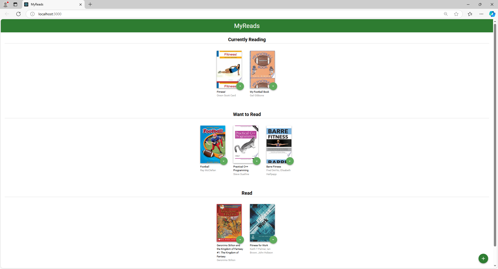

# MyReads App

### Description
A simple app that allows users to organize their books in categories.

**IMPORTANT NOTE:**
Please Turn On THIRD-PARTY Cookies on Google Chrome or keep The tracking preventation At Basic in Microsoft Edge, in order to compile the App without any ERRORS.
Thanks.

### Features
- View books in different shelves based on their reading status (Currently Reading, Want to Read, Read).
- Search for books by title or author.
- Move books between shelves.
- The application saves your book data, so it persists even after a page refresh.

---

## Installation and Setup Instructions

### Prerequisites
To run this project locally, you need to have:
- **Node.js** installed (preferably the latest version).
- **npm** installed.

### Clone the repository:
git clone https://github.com/hazaaAlmarzooqi/v3_udacity.git

cd v3_udacity

### Install dependencies:
To install all the required dependencies for the project, use
**npm install**

### Running the Application

To run the development server locally:
**npm start**

Once the development server starts, open your browser and navigate to:
**http://localhost:3000**


## What You're Getting

```bash
├── CONTRIBUTING.md
├── README.md - This file.
├── SEARCH_TERMS.md # The whitelisted short collection of available search terms for you to use with your app.
├── package.json # npm package manager file. It's unlikely that you'll need to modify this.
├── public
│   ├── favicon.ico # React Icon, You may change if you wish.
│   └── index.html # DO NOT MODIFY
└── src
    ├── App.css # Styles for your app. Feel free to customize this as you desire.
    ├── App.js # This is the root of your app. Contains static HTML right now.
    ├── App.test.js # Used for testing. Provided with Create React App. Testing is encouraged, but not required.
    ├── BooksAPI.js # A JavaScript API for the provided Udacity backend. Instructions for the methods are below.
    ├── icons # Helpful images for your app. Use at your discretion.
    │   ├── add.svg
    │   ├── arrow-back.svg
    │   └── arrow-drop-down.svg
    ├── index.css # Global styles. You probably won't need to change anything here.
    └── index.js # You should not need to modify this file. It is used for DOM rendering only.
```

### Main Components

- **MainPage**: The homepage where users can view their books categorized into shelves.
- **SearchBooks**: The search page where users can find new books to add to their collection.
- **Book**: The individual book component that displays a book's details (title, author, image).

---

## Usage

1. **Main Page**: 
   - On the main page, books are categorized into three sections: **Currently Reading**, **Want to Read**, and **Read**.
   - You can move books by selecting the desired shelf from the dropdown menu.

2. **Search Page**: 
   - Navigate to the search page by clicking the "Search Books" button.
   - Use the search bar to look for books by title or author.
   - Add a book.

---

## State Management

The application uses **React's \`useState\` hook** to manage the state of the books. It saves the current book list to the browser's **localStorage**, ensuring that the user's selections persist even after a page refresh.

---

## Technologies Used

- **React.js**: The main library used to build the UI.
- **React Router**: For navigation between different pages (Main Page and Search Page).
- **HTML5/CSS3**: For structure and styling.
- **localStorage**: To persist data between page refreshes.

---

## Screenshots

Here you can add some screenshots of the app for visual reference:

- **Main Page**:
  


- **Search Page**:
  


---

## Contact

If you have any questions or suggestions, feel free to contact me:
- Email: hazza3.ae12@gmail.com
- GitHub: [hazaaAlmarzooqi](https://github.com/hazaaAlmarzooqi)
